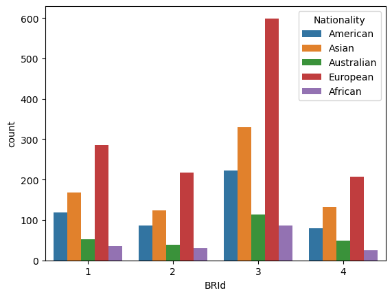

```python
import mysql.connector
import pandas as pd

cnx = mysql.connector.connect(
    host="localhost",
    port=3306,
    user="root",
    password="rajkumar@1418")
    
```


```python
query = "SELECT * FROM banking_caes.customer"
```


```python
df = pd.read_sql(query, cnx)
```

    C:\Users\Raaj\AppData\Local\Temp\ipykernel_31248\1600954950.py:1: UserWarning: pandas only supports SQLAlchemy connectable (engine/connection) or database string URI or sqlite3 DBAPI2 connection. Other DBAPI2 objects are not tested. Please consider using SQLAlchemy.
      df = pd.read_sql(query, cnx)
    


```python
cnx.close()
```


```python
print(df)
```

         Client ID              Name  Age  Location ID Joined Bank  \
    0        IND81288     Raymond Mills   24        34324  06-05-2019   
    1        IND65833     Julia Spencer   23        42205  10-12-2001   
    2        IND47499    Stephen Murray   27         7314  25-01-2010   
    3        IND72498    Virginia Garza   40        34594  28-03-2019   
    4        IND60181   Melissa Sanders   46        41269  20-07-2012   
    ...           ...               ...  ...          ...         ...   
    2995     IND66827         Earl Hall   82         8760  09-10-2014   
    2996     IND40556  Billy Williamson   44        32837  05-02-2009   
    2997     IND72414      Victor Black   70        36088  29-12-2009   
    2998     IND46652       Andrew Ford   56        24871  13-02-2006   
    2999     IND40216        Amy Nguyen   79        38518  08-12-2005   
    
              Banking Contact Nationality                     Occupation  \
    0          Anthony Torres    American           Safety Technician IV   
    1        Jonathan Hawkins     African            Software Consultant   
    2           Anthony Berry    European             Help Desk Operator   
    3              Steve Diaz    American                   Geologist II   
    4              Shawn Long    American            Assistant Professor   
    ...                   ...         ...                            ...   
    2995       Joshua Bennett    American       Accounting Assistant III   
    2996          Dennis Ruiz    European                      Paralegal   
    2997          Joshua Ryan    American                Statistician IV   
    2998  Nicholas Cunningham    European  Human Resources Assistant III   
    2999           Joe Hanson    American            Biostatistician III   
    
         Fee Structure Loyalty Classification  ...  Bank Deposits  \
    0             High                   Jade  ...     1485828.64   
    1             High                   Jade  ...      641482.79   
    2             High                   Gold  ...     1033401.59   
    3              Mid                 Silver  ...     1048157.49   
    4              Mid               Platinum  ...      487782.53   
    ...            ...                    ...  ...            ...   
    2995          High                   Gold  ...     1089957.03   
    2996           Mid                   Gold  ...      136891.32   
    2997           Low                   Jade  ...      214860.89   
    2998           Mid                   Jade  ...      742630.22   
    2999          High                   Jade  ...       65617.66   
    
          Checking Accounts  Saving Accounts  Foreign Currency Account  \
    0             603617.88        607332.46                  12249.96   
    1             229521.37        344635.16                  61162.31   
    2             652674.69        203054.35                  79071.78   
    3            1048157.49        234685.02                  57513.65   
    4             446644.25        128351.45                  30012.14   
    ...                 ...              ...                       ...   
    2995          532867.88        657849.62                  12947.31   
    2996           56581.74         93195.61                  23205.69   
    2997          158726.06         35539.15                  30291.81   
    2998          404638.26         56411.33                   6413.14   
    2999           77769.08         32371.38                   8992.36   
    
          Business Lending  Properties Owned  Risk Weighting  BRId  GenderId  IAId  
    0           1134475.30                 1               2     1         1     1  
    1           2000526.10                 1               3     2         1     2  
    2            548137.58                 1               3     3         2     3  
    3           1148402.29                 0               4     4         1     4  
    4           1674412.12                 0               3     1         2     5  
    ...                ...               ...             ...   ...       ...   ...  
    2995        1238859.91                 1               3     3         2     4  
    2996         277171.07                 1               2     3         2     5  
    2997         502947.22                 2               2     3         2     6  
    2998        1538368.60                 3               1     3         2     7  
    2999         329412.55                 1               1     3         2     8  
    
    [3000 rows x 25 columns]
    


```python
df.head()
```


<div>
<style scoped>
    .dataframe tbody tr th:only-of-type {
        vertical-align: middle;
    }

    .dataframe tbody tr th {
        vertical-align: top;
    }

    .dataframe thead th {
        text-align: right;
    }
</style>
<table border="1" class="dataframe">
  <thead>
    <tr style="text-align: right;">
      <th></th>
      <th>Client ID</th>
      <th>Name</th>
      <th>Age</th>
      <th>Location ID</th>
      <th>Joined Bank</th>
      <th>Banking Contact</th>
      <th>Nationality</th>
      <th>Occupation</th>
      <th>Fee Structure</th>
      <th>Loyalty Classification</th>
      <th>...</th>
      <th>Bank Deposits</th>
      <th>Checking Accounts</th>
      <th>Saving Accounts</th>
      <th>Foreign Currency Account</th>
      <th>Business Lending</th>
      <th>Properties Owned</th>
      <th>Risk Weighting</th>
      <th>BRId</th>
      <th>GenderId</th>
      <th>IAId</th>
    </tr>
  </thead>
  <tbody>
    <tr>
      <th>0</th>
      <td>IND81288</td>
      <td>Raymond Mills</td>
      <td>24</td>
      <td>34324</td>
      <td>06-05-2019</td>
      <td>Anthony Torres</td>
      <td>American</td>
      <td>Safety Technician IV</td>
      <td>High</td>
      <td>Jade</td>
      <td>...</td>
      <td>1485828.64</td>
      <td>603617.88</td>
      <td>607332.46</td>
      <td>12249.96</td>
      <td>1134475.30</td>
      <td>1</td>
      <td>2</td>
      <td>1</td>
      <td>1</td>
      <td>1</td>
    </tr>
    <tr>
      <th>1</th>
      <td>IND65833</td>
      <td>Julia Spencer</td>
      <td>23</td>
      <td>42205</td>
      <td>10-12-2001</td>
      <td>Jonathan Hawkins</td>
      <td>African</td>
      <td>Software Consultant</td>
      <td>High</td>
      <td>Jade</td>
      <td>...</td>
      <td>641482.79</td>
      <td>229521.37</td>
      <td>344635.16</td>
      <td>61162.31</td>
      <td>2000526.10</td>
      <td>1</td>
      <td>3</td>
      <td>2</td>
      <td>1</td>
      <td>2</td>
    </tr>
    <tr>
      <th>2</th>
      <td>IND47499</td>
      <td>Stephen Murray</td>
      <td>27</td>
      <td>7314</td>
      <td>25-01-2010</td>
      <td>Anthony Berry</td>
      <td>European</td>
      <td>Help Desk Operator</td>
      <td>High</td>
      <td>Gold</td>
      <td>...</td>
      <td>1033401.59</td>
      <td>652674.69</td>
      <td>203054.35</td>
      <td>79071.78</td>
      <td>548137.58</td>
      <td>1</td>
      <td>3</td>
      <td>3</td>
      <td>2</td>
      <td>3</td>
    </tr>
    <tr>
      <th>3</th>
      <td>IND72498</td>
      <td>Virginia Garza</td>
      <td>40</td>
      <td>34594</td>
      <td>28-03-2019</td>
      <td>Steve Diaz</td>
      <td>American</td>
      <td>Geologist II</td>
      <td>Mid</td>
      <td>Silver</td>
      <td>...</td>
      <td>1048157.49</td>
      <td>1048157.49</td>
      <td>234685.02</td>
      <td>57513.65</td>
      <td>1148402.29</td>
      <td>0</td>
      <td>4</td>
      <td>4</td>
      <td>1</td>
      <td>4</td>
    </tr>
    <tr>
      <th>4</th>
      <td>IND60181</td>
      <td>Melissa Sanders</td>
      <td>46</td>
      <td>41269</td>
      <td>20-07-2012</td>
      <td>Shawn Long</td>
      <td>American</td>
      <td>Assistant Professor</td>
      <td>Mid</td>
      <td>Platinum</td>
      <td>...</td>
      <td>487782.53</td>
      <td>446644.25</td>
      <td>128351.45</td>
      <td>30012.14</td>
      <td>1674412.12</td>
      <td>0</td>
      <td>3</td>
      <td>1</td>
      <td>2</td>
      <td>5</td>
    </tr>
  </tbody>
</table>
<p>5 rows × 25 columns</p>
</div>


```python
df.describe()
```


<div>
<style scoped>
    .dataframe tbody tr th:only-of-type {
        vertical-align: middle;
    }

    .dataframe tbody tr th {
        vertical-align: top;
    }

    .dataframe thead th {
        text-align: right;
    }
</style>
<table border="1" class="dataframe">
  <thead>
    <tr style="text-align: right;">
      <th></th>
      <th>Age</th>
      <th>Location ID</th>
      <th>Estimated Income</th>
      <th>Superannuation Savings</th>
      <th>Amount of Credit Cards</th>
      <th>Credit Card Balance</th>
      <th>Bank Loans</th>
      <th>Bank Deposits</th>
      <th>Checking Accounts</th>
      <th>Saving Accounts</th>
      <th>Foreign Currency Account</th>
      <th>Business Lending</th>
      <th>Properties Owned</th>
      <th>Risk Weighting</th>
      <th>BRId</th>
      <th>GenderId</th>
      <th>IAId</th>
    </tr>
  </thead>
  <tbody>
    <tr>
      <th>count</th>
      <td>3000.000000</td>
      <td>3000.000000</td>
      <td>3000.000000</td>
      <td>3000.000000</td>
      <td>3000.000000</td>
      <td>3000.000000</td>
      <td>3.000000e+03</td>
      <td>3.000000e+03</td>
      <td>3.000000e+03</td>
      <td>3.000000e+03</td>
      <td>3000.000000</td>
      <td>3.000000e+03</td>
      <td>3000.000000</td>
      <td>3000.000000</td>
      <td>3000.000000</td>
      <td>3000.000000</td>
      <td>3000.000000</td>
    </tr>
    <tr>
      <th>mean</th>
      <td>51.039667</td>
      <td>21563.323000</td>
      <td>171305.034263</td>
      <td>25531.599673</td>
      <td>1.463667</td>
      <td>3176.206943</td>
      <td>5.913862e+05</td>
      <td>6.715602e+05</td>
      <td>3.210929e+05</td>
      <td>2.329084e+05</td>
      <td>29883.529993</td>
      <td>8.667598e+05</td>
      <td>1.518667</td>
      <td>2.249333</td>
      <td>2.559333</td>
      <td>1.504000</td>
      <td>10.425333</td>
    </tr>
    <tr>
      <th>std</th>
      <td>19.854760</td>
      <td>12462.273017</td>
      <td>111935.808209</td>
      <td>16259.950770</td>
      <td>0.676387</td>
      <td>2497.094709</td>
      <td>4.575570e+05</td>
      <td>6.457169e+05</td>
      <td>2.820796e+05</td>
      <td>2.300078e+05</td>
      <td>23109.924010</td>
      <td>6.412303e+05</td>
      <td>1.102145</td>
      <td>1.131191</td>
      <td>1.007713</td>
      <td>0.500067</td>
      <td>5.988242</td>
    </tr>
    <tr>
      <th>min</th>
      <td>17.000000</td>
      <td>12.000000</td>
      <td>15919.480000</td>
      <td>1482.030000</td>
      <td>1.000000</td>
      <td>1.170000</td>
      <td>0.000000e+00</td>
      <td>0.000000e+00</td>
      <td>0.000000e+00</td>
      <td>0.000000e+00</td>
      <td>45.000000</td>
      <td>0.000000e+00</td>
      <td>0.000000</td>
      <td>1.000000</td>
      <td>1.000000</td>
      <td>1.000000</td>
      <td>1.000000</td>
    </tr>
    <tr>
      <th>25%</th>
      <td>34.000000</td>
      <td>10803.500000</td>
      <td>82906.595000</td>
      <td>12513.775000</td>
      <td>1.000000</td>
      <td>1236.630000</td>
      <td>2.396281e+05</td>
      <td>2.044004e+05</td>
      <td>1.199475e+05</td>
      <td>7.479440e+04</td>
      <td>11916.542500</td>
      <td>3.748251e+05</td>
      <td>1.000000</td>
      <td>1.000000</td>
      <td>2.000000</td>
      <td>1.000000</td>
      <td>5.000000</td>
    </tr>
    <tr>
      <th>50%</th>
      <td>51.000000</td>
      <td>21129.500000</td>
      <td>142313.480000</td>
      <td>22357.355000</td>
      <td>1.000000</td>
      <td>2560.805000</td>
      <td>4.797934e+05</td>
      <td>4.633165e+05</td>
      <td>2.428157e+05</td>
      <td>1.640866e+05</td>
      <td>24341.190000</td>
      <td>7.113147e+05</td>
      <td>2.000000</td>
      <td>2.000000</td>
      <td>3.000000</td>
      <td>2.000000</td>
      <td>10.000000</td>
    </tr>
    <tr>
      <th>75%</th>
      <td>69.000000</td>
      <td>32054.500000</td>
      <td>242290.305000</td>
      <td>35464.740000</td>
      <td>2.000000</td>
      <td>4522.632500</td>
      <td>8.258130e+05</td>
      <td>9.427546e+05</td>
      <td>4.348749e+05</td>
      <td>3.155750e+05</td>
      <td>41966.392500</td>
      <td>1.185110e+06</td>
      <td>2.000000</td>
      <td>3.000000</td>
      <td>3.000000</td>
      <td>2.000000</td>
      <td>15.000000</td>
    </tr>
    <tr>
      <th>max</th>
      <td>85.000000</td>
      <td>43369.000000</td>
      <td>522330.260000</td>
      <td>75963.900000</td>
      <td>3.000000</td>
      <td>13991.990000</td>
      <td>2.667557e+06</td>
      <td>3.890598e+06</td>
      <td>1.969923e+06</td>
      <td>1.724118e+06</td>
      <td>124704.870000</td>
      <td>3.825962e+06</td>
      <td>3.000000</td>
      <td>5.000000</td>
      <td>4.000000</td>
      <td>2.000000</td>
      <td>22.000000</td>
    </tr>
  </tbody>
</table>
</div>


```python
df.info()
```

    <class 'pandas.core.frame.DataFrame'>
    RangeIndex: 3000 entries, 0 to 2999
    Data columns (total 25 columns):
     #   Column                    Non-Null Count  Dtype  
    ---  ------                    --------------  -----  
     0   Client ID              3000 non-null   object 
     1   Name                      3000 non-null   object 
     2   Age                       3000 non-null   int64  
     3   Location ID               3000 non-null   int64  
     4   Joined Bank               3000 non-null   object 
     5   Banking Contact           3000 non-null   object 
     6   Nationality               3000 non-null   object 
     7   Occupation                3000 non-null   object 
     8   Fee Structure             3000 non-null   object 
     9   Loyalty Classification    3000 non-null   object 
     10  Estimated Income          3000 non-null   float64
     11  Superannuation Savings    3000 non-null   float64
     12  Amount of Credit Cards    3000 non-null   int64  
     13  Credit Card Balance       3000 non-null   float64
     14  Bank Loans                3000 non-null   float64
     15  Bank Deposits             3000 non-null   float64
     16  Checking Accounts         3000 non-null   float64
     17  Saving Accounts           3000 non-null   float64
     18  Foreign Currency Account  3000 non-null   float64
     19  Business Lending          3000 non-null   float64
     20  Properties Owned          3000 non-null   int64  
     21  Risk Weighting            3000 non-null   int64  
     22  BRId                      3000 non-null   int64  
     23  GenderId                  3000 non-null   int64  
     24  IAId                      3000 non-null   int64  
    dtypes: float64(9), int64(8), object(8)
    memory usage: 586.1+ KB
    


```python
df.shape
```


    (3000, 25)


```python
import numpy as np
import pandas as pd
import seaborn as sns
import matplotlib.pyplot as plt
```


```python
df['Estimated Income'].value_counts()
```


    Estimated Income
    56826.53     1
    75384.77     1
    289834.31    1
    169935.23    1
    356808.11    1
                ..
    115637.19    1
    111449.06    1
    74966.51     1
    65369.36     1
    87849.47     1
    Name: count, Length: 3000, dtype: int64


```python
df['Estimated Income'].min()
```


    15919.48


```python
bins = [0, 100000, 300000, float('inf')]
labels = ['Low', 'Med', 'High']

df['Income Band'] = pd.cut(df['Estimated Income'], bins=bins, labels=labels, right=False)
```


```python
df['Income Band'].value_counts().plot(kind='bar')
```


    <Axes: xlabel='Income Band'>


    

    


```python
print(df.columns.tolist())
```

    ['Client ID', 'Name', 'Age', 'Location ID', 'Joined Bank', 'Banking Contact', 'Nationality', 'Occupation', 'Fee Structure', 'Loyalty Classification', 'Estimated Income', 'Superannuation Savings', 'Amount of Credit Cards', 'Credit Card Balance', 'Bank Loans', 'Bank Deposits', 'Checking Accounts', 'Saving Accounts', 'Foreign Currency Account', 'Business Lending', 'Properties Owned', 'Risk Weighting', 'BRId', 'GenderId', 'IAId', 'Income Band']
    


```python
categorical_cols = df[["BRId", "GenderId", "IAId", "Amount of Credit Cards", "Nationality", "Occupation", "Fee Structure", "Loyalty Classification", "Properties Owned", "Risk Weighting", "Income Band"]].columns

for col in categorical_cols:
    print(f"Value Counts for'{col}':")
    display(df[col].value_counts())
```

    Value Counts for'BRId':
    


    BRId
    3    1352
    1     660
    2     495
    4     493
    Name: count, dtype: int64


    Value Counts for'GenderId':
    


    GenderId
    2    1512
    1    1488
    Name: count, dtype: int64


    Value Counts for'IAId':
    


    IAId
    1     177
    2     177
    3     177
    4     177
    8     177
    9     176
    13    176
    12    176
    10    176
    11    176
    14    176
    15    176
    6      89
    5      89
    7      89
    16     88
    17     88
    18     88
    19     88
    20     88
    21     88
    22     88
    Name: count, dtype: int64


    Value Counts for'Amount of Credit Cards':
    


    Amount of Credit Cards
    1    1922
    2     765
    3     313
    Name: count, dtype: int64


    Value Counts for'Nationality':
    


    Nationality
    European      1309
    Asian          754
    American       507
    Australian     254
    African        176
    Name: count, dtype: int64


    Value Counts for'Occupation':
    


    Occupation
    Associate Professor             28
    Structural Analysis Engineer    28
    Recruiter                       25
    Account Coordinator             24
    Human Resources Manager         24
                                    ..
    Office Assistant IV              8
    Automation Specialist I          7
    Computer Systems Analyst I       6
    Developer III                    5
    Senior Sales Associate           4
    Name: count, Length: 195, dtype: int64


    Value Counts for'Fee Structure':
    


    Fee Structure
    High    1476
    Mid      962
    Low      562
    Name: count, dtype: int64


    Value Counts for'Loyalty Classification':
    


    Loyalty Classification
    Jade        1331
    Silver       767
    Gold         585
    Platinum     317
    Name: count, dtype: int64


    Value Counts for'Properties Owned':
    


    Properties Owned
    2    777
    1    776
    3    742
    0    705
    Name: count, dtype: int64


    Value Counts for'Risk Weighting':
    


    Risk Weighting
    2    1222
    1     836
    3     460
    4     322
    5     160
    Name: count, dtype: int64


    Value Counts for'Income Band':
    


    Income Band
    Med     1517
    Low     1027
    High     456
    Name: count, dtype: int64


**UNIVARIATE ANALYSIS**


```python
for i, predictor in enumerate(df[["BRId", "GenderId", "IAId", "Amount of Credit Cards", "Nationality", "Occupation", "Fee Structure", "Loyalty Classification", "Properties Owned", "Risk Weighting", "Income Band"]].columns):
    plt.figure(i)
    sns.countplot(data=df, x=predictor)
```


    

    


    

    


    

    


    

    


    

    


    

    


    

    


    

    


    

    


    

    


    

    


**BIVARIATE ANALYSIS**


```python
for i, predictor in enumerate(df[["BRId", "GenderId", "IAId", "Amount of Credit Cards", "Nationality", "Occupation", "Fee Structure", "Loyalty Classification", "Properties Owned", "Risk Weighting", "Income Band"]].columns):
    plt.figure(i)
    sns.countplot(data=df, x=predictor, hue='Nationality')
```


    

    


    

    


    

    


    

    


    

    


    

    


    

    


    

    


    

    


    

    


    

    


```python
#Histplot of value counts for different Occupation

for col in categorical_cols:
  if col == "Occupation":
      continue
  plt.figure(figsize=(8,4))
  sns.histplot(df[col])
  plt.title('Histogram of Occupation Count')
  plt.xlabel(col)
  plt.ylabel("Count")
  plt.show()
```


    

    


    

    


    

    


    

    


    

    


    

    


    

    


    

    


    

    


    

    


**NUMERICAL ANALYSIS**


```python
numerical_cols  = ['Estimated Income', 'Superannuation Savings', 'Credit Card Balance', 'Bank Loans', 'Bank Deposits', 'Checking Accounts', 'Saving Accounts', 'Foreign Currency Account', 'Business Lending']
#Univariate analysis and visualization
plt.figure(figsize=(15,10))
for i,col in enumerate(numerical_cols):
    plt.subplot(4,3,i+1)
    sns.histplot(df[col],kde=True)
    plt.title(col)
    plt.tight_layout()
plt.show()
```


    

    


**HEATMAPS**


```python
numerical_cols  = ['Estimated Income', 'Superannuation Savings', 'Credit Card Balance', 'Bank Loans', 'Bank Deposits', 'Checking Accounts', 'Saving Accounts', 'Foreign Currency Account', 'Business Lending']
correlation_matrix = df[numerical_cols].corr()

plt.figure(figsize=(12,12))
sns.heatmap(correlation_matrix, annot=True, cmap='crest', fmt=".2f")
plt.title("Correlation Matrix")
plt.show()
```


    

    


```python

```
